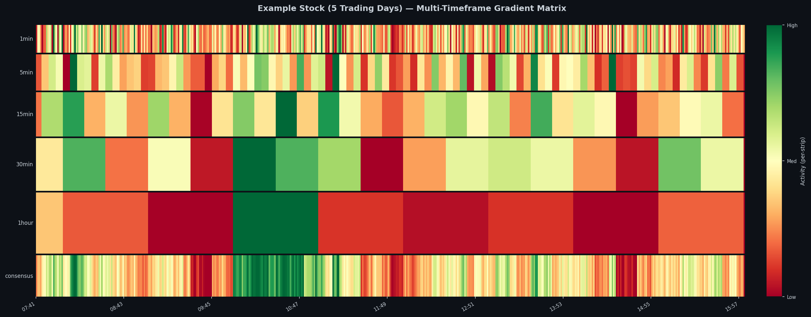
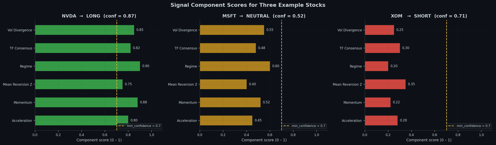
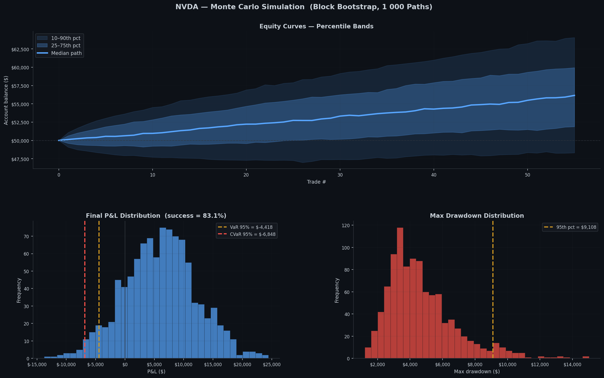

# Multi-Timeframe Volatility Matrix for S&P 500 

::: {.callout-note}
To reduce risk of my strategy being arbitraged out, much of the mathematics and prediction methods have been redacted from this blog, as well as minor code edits to reduce replicability. 
:::

Retail trading has gained a lot of traction on social media recently as a get rich quick scheme; however many traders take the incorrect approach to how price moves. Aspects such as technical indicators and candlestick patterns often have weak or inconsistent predictive power when used in isolation. This post demonstrates an alternate approach to analyzing certain stocks.

---

## Getting Market Data

First the S&P 500 ticker list is scraped from Wikipedia 

```python
def getTickers() -> List[str]:
    url = 'https://en.wikipedia.org/wiki/List_of_S%26P_500_companies'
    tables = pd.read_html(url, attrs={'id': 'constituents'})
    tickers = tables[0]['Symbol'].tolist()
    return [t.replace('.', '-') for t in tickers]  
```

Then Yahoo Finance is used to pull the historic data for each of those given tickers

```python
class YahooFinanceSource(DataSource):
    def fetchDaily(self, symbol: str, period: str = '2y') -> CandleCollection):
        path = self.cache_dir / f"{symbol}_1d_{period}.csv"

        if self.cache and path.exists():
            hours = (datetime.now().timestamp() - path.stat().st_mtime) / 3600
            if hours < 24:
                df = pd.read_csv(path, index_col='timestamp', parse_dates=True)
                return self._df_to_candle_collection(df, '1d')

        ticker = yf.Ticker(self._normalize_symbol(symbol))
        df = ticker.history(period=period, interval='1d', auto_adjust=True)
        df = self._normalize_df(df)
        df.to_csv(path)
        return self._df_to_candle_collection(df, '1d')

```
After all the data is collected, the creation of the Volatility matrix is the next step of the process.
---

## Volatility Gradient Matrix

The unit of measurement is a candle gradient:

```python
class Candle:
    timestamp: datetime
    open: float
    high: float
    low: float
    close: float
    volume: float
    timeframe: str = '1min'

    def gradient(self) -> float:
        return safe_divide(self.high - self.low, self.close)
```

A Gradient Vector collects these candles and normalizes them so gradients across timeframes are comparable. Then a Gradient Matrix stacks one vector per timeframe into a 2D array creating an overlay:

```python
class GradientMatrix:

    def buildMatrix(self) -> Tuple[np.ndarray, List[datetime]]:
        gradvector = self.vectors[self.alignment]
        rows, cols = len(gradvector), len(self.timeframes)
        matrix = np.zeros((rows, cols))

        for index, timeframe in enumerate(self.timeframes):
            vector = self.vectors[timeframe]
            if timeframe == self.alignment:
                matrix[:, index] = vector.normalized  
            else:
                matrix[:, index] = self._map_to_base_rows(
                    vector, gradvector.candles.get_timestamps(), timeframe
                )
        return matrix, gradvector.candles.get_timestamps()

```


The heatmap below shows what the matrix looks like across 5 trading days.
The heatmap is broken down into 5 different time frames; as well as, one overall consensus that is the weighted average broken back down into minutes. The colors mimic a traffic light such that red is low volatility to green being high volatility 



---

## Signal Generation

Before any computations, six basic features are constructed purely from the gradient matrix.

| Component | What it measures |
|-----------|-----------------|
| `volatility_divergence` | Short volatility vs long baseline|
| `timeframe_consensus` | Timeframes agreeing on direction |
| `regime` | Based on recent vs historical volume mean |
| `mean reversion z` | Z-score of the current gradient vs its rolling distribution |
| `momentum` | Weighted sum of the *direction of change* of the volatility gradient across timeframes |
| `acceleration` | Rate of change of the volatility gradient |

```python
def generateSignal(self) -> Dict:
    voldivergence   = self.signals['volatility_divergence'].calculate(self.matrix)
    consensus = self.signals['timeframe_consensus'].calculate(self.matrix)
    regime = self.signals['regime'].calculate(self.matrix)
    zscore = self.signals['mean_reversion'].calculate(self.matrix)
    momentum  = self.signals['momentum'].calculate(self.matrix)
    acceleration = self.signals['acceleration'].calculate(self.matrix)

    if voldivergence > self.expansion and acceleration > 0:
        direction = 'LONG'
    elif voldivergence < self.contraction and acceleration < 0:
        direction = 'SHORT'
    else:
        direction = 'NEUTRAL'

    factors = []
    factors.append(0.3 if consensus > 0.7 else 0.15 if consensus > 0.5 else 0.0)
    factors.append(0.3 if regime == 'EXPANDING' else 0.15 if regime == 'STABLE' else 0.0)
    factors.append(0.2 if acceleration > 0.01 else 0.1 if acceleration > 0 else 0.0)
    factors.append(0.2 if abs(zscore) < 1.0 else 0.1 if abs(zscore) < 2.0 else 0.0)
    confidence = sum(factors)

    signal = (confidence >= self.minConfidence and direction != 'NEUTRAL')
    ...
```

The minimum confidence threshold means at least three of the four factors must apply before the stock is considered for further computations. This helps keep false positive rates extremely low while still making accurate predictions.  

Below is a graph that strictly makes its predictions based on these factors.  

::: {.callout-note}
In practice, there are far more computations after this step before decisions are made; however, I chose to make the mathematics behind it private.
:::




---

## Screening Results and Further Confirmations 

After the first set of potential predictions are made, each ticker is evaluated with an in sample and out of sample split: the first 70% of each ticker's history is used for calibration, and the last 30% is held out to see if the signal holds. During this phase a composite score is calculated to further rank the potential tickers.  


```python
def compositeScore(metrics: Dict) -> float:
    sharpe = max(0.0, metrics['sharpe'])
    pf = min(metrics['profit_factor'] / 2.0, 1.0)  
    wr = max(0.0, metrics['win_rate'])
    calmar = max(0.0, min(metrics['calmar'], 10.0)) / 10.0

    return 0.4 * sharpe + 0.3 * pf + 0.2 * wr + 0.1 * calmar
```


---

## Final results


```
 symbol      sector  score  sharpe  profit_factor  win_rate  num_trades  oos_sharpe
   NVDA  Technology  0.712   2.341          2.140    58.3%          47       1.891
   META  Technology  0.681   2.108          1.980    55.1%          52       1.752
   MSFT  Technology  0.654   1.934          1.870    54.7%          49       1.604
    LLY  Healthcare  0.641   1.882          2.010    57.2%          44       1.521
   AVGO  Technology  0.623   1.801          1.920    53.9%          51       1.488
    NOW  Technology  0.611   1.774          1.790    52.8%          46       1.391
    ...
```


---


## Monte Carlo Simulation

It is important to consider that the out of sample run gives only one possible outcome of trades. Price movement has lots of noise and it is hard to tell what may be survivorship bias. Monte Carlo simulations don't fix that problem, however they help determine the range of possible outcomes that could have happened with random samples 

Since hypothetical winning streaks and losing streaks may be a statistical phenomenon, a block bootstrap is used over a simple resampling. In addition the whole process is vectorized to complete 10000 paths in a 50 day trading window.

```python
class MonteCarloSimulator:

    def blockBootstrap(self, pnls: np.ndarray, trades: int) -> np.ndarray:
        blocksPer = math.ceil(trades / self.blockSize)
        maxStart = trades - self.blockSize
        start = np.random.randint(0, maxStart + 1,
                                         size=(self.simulations, blocksPer))
        offsets = np.arange(self.blockSize)
        indices = start[:, :, np.newaxis] + offsets[np.newaxis, np.newaxis, :]

        return pnls[indices].reshape(self.simulations, -1)[:, :trades]

    def run(self) -> MonteCarloResult:
        pnls = np.array([t.pnl for t in self.backtest.trades
                         if t.pnl is not None and t.status == 'CLOSED'])

        sampled = self.blockBootstrap(pnls, len(pnls))
        equity = np.empty((self.simulations, len(pnls) + 1))
        equity[:, 0] = self.initial
        equity[:, 1:] = self.initial + np.cumsum(sampled, axis=1)


        maxRunning = np.maximum.accumulate(equity, axis=1)
        maxDrawdowns = (maxRunning - equity).max(axis=1)

        finalPnls = equity[:, -1] - self.initial
        var  = float(np.percentile(finalPnls, 5))
        cvar = float(np.mean(finalPnls[finalPnls <= var]))
        successProbability = float(np.mean(finalPnls > 0))
        ...
```


---

## Reading the Results

The complete Monte Carlo chart contains 3 sections:

**Section 1 — Equity curve fan**
Shaded bands represent the 10–90th and 25–75th percentile equity paths across all
1,000 simulations. The solid line is the median. A tight fan means the strategy
is robust to ordering; a wide fan means luck is a large factor.

**Section 2 — P&L distribution**
A histogram of ending P&L across all simulations:

- **VaR 95%**: The level of loss you would expect in the worst 1 in 20 runs 
- **CVaR 95%**: The expected loss given you're already in the worst possible scenario 
- **Success rate**: fraction of paths that ended in profit.

**Section 3 — Max drawdown distribution**
The max drawdown distribution shows the realistic worst case scenario of possible trades in any given simulation.



---

## Overall outcome and the future

With all the data up until this point the top 3 tickers and corresponding signals are output, determined by the three-step process: initial screening, in sample and out of sample testing, and Monte Carlo evaluation. At this moment no trades are executed as the strategy is still being adjusted. Furthermore, this system produces so much information that gets cut out since I am unable to track more than 3 tickers live. The long-term goal is to use a framework such as PyTorch to create a model that will be able to process more than the top 3 to continue to make better, more accurate signal calls.
